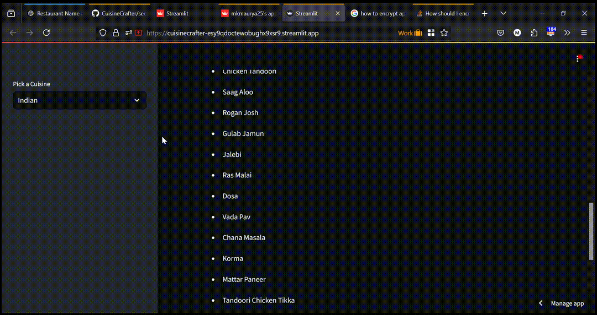

<!---->

# Welcome to My Portfolio
This page contains a short description and project links to various Data Science prjoects.

  <!-- Use ../ to navigate to the root directory -->

[CuisineCrafter](https://github.com/mkmaurya25/CuisineCrafter)
